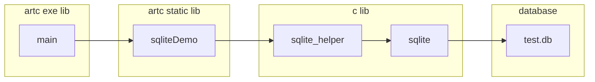

# [SID_0002] Sqlite Demo


# 简介 / Introduction

该例程用来演示artc的多库集成编译能力。

This sample is used to demonstrate the multi library integration compilation capability of Artc..


# 适用环境 / Prerequisites or Environment


# 文件结构 / File Structure


```c
SID_0002/
│
├── .gitignore
├── SID_0002.acws
├── main/
│   ├── .gitignore
│   ├── main.aclib
│   └── src/
│       ├── main.artc
│       └── main.test.artc
│
├── sqliteDemo/
│   ├── src/
│   │   ├── lib.artc
│   │   └── lib.test.artc
│   ├── .gitignore
│   └── main.aclib
│
└── sqlite/
    ├── sqlite_helper.c
    ├── sqlite_helper.h
    ├── sqlite3.c
    └── sqlite3.h
```

# 编译方法 / How to Build


# 运行方法 / How to Run


# 关键代码说明 / Key Code Explanation


库引用关系 / ibrary reference relationship




# 常见问题 / FAQs or Troubleshooting


# 扩展练习 / Exercises or Next Steps


# 参考资料 / References

