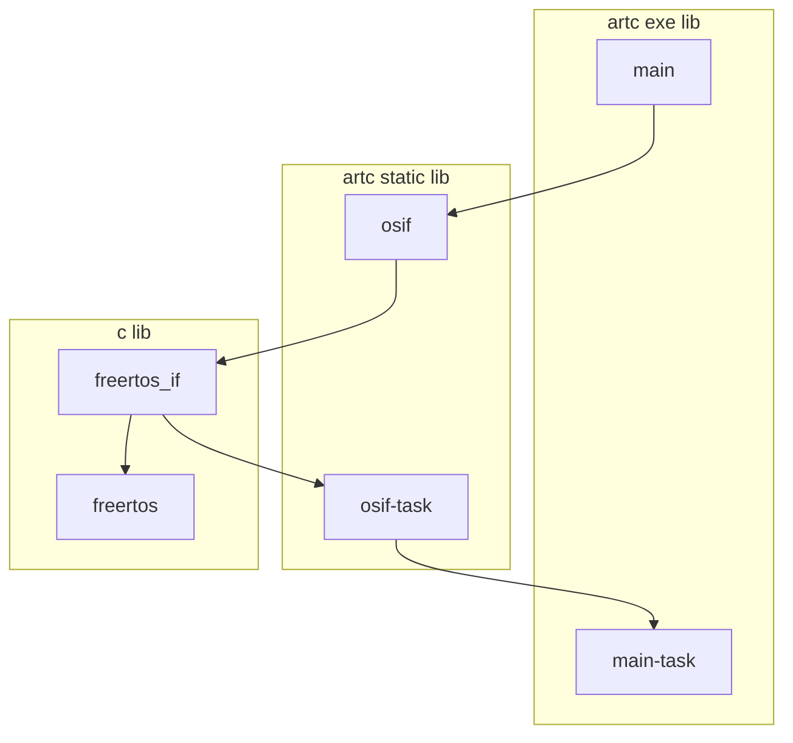

# [SID_0003] FreeRTOS


# 简介 / Introduction

一句话或一段话说明该示例演示了什么功能或知识点。

Explain in one sentence or paragraph what function or knowledge point the sample demonstrates.


# 适用环境 / Prerequisites or Environment

操作系统、编译器/解释器版本、依赖库、构建工具等。

Operating system, compiler/interpreter version, dependency libraries, build tools, etc.


# 文件结构 / File Structure

列出该示例涉及的主要文件及其作用（如 .c, .h, Makefile 等）。

List the main files involved in this example and their roles (such as. c,. h, Makefile, etc.).

```c
SID_XXXX/
│
├── .gitignore
├── SID_XXXX.acws
├── main/
│   ├── .gitignore
│   ├── main.aclib
│   └── src/
│       ├── main.artc
│       └── main.test.artc
│
├── dir2/
│   ├── sub-dir1/
│   │   └── file3.ext
│   └── sub-dir2/
│
└── dir3/
    ├── file4.ext
    └── file5.ext
```

# 编译方法 / How to Build

命令行编译步骤（如 gcc -o example example.c）或使用 make。

Command line compilation steps (such as gcc - o example. c) or use make.


# 运行方法 / How to Run

运行命令及预期输出示例。

Example of Running Commands and Expected Output.


# 关键代码说明 / Key Code Explanation

解释核心逻辑、函数、重要语句的作用（可配合行号或代码片段）。

Explain the role of core logic, functions, and important statements (which can be combined with line numbers or code snippets).





# 常见问题 / FAQs or Troubleshooting

可能遇到的编译或运行错误及解决办法。

Possible compilation or runtime errors and their solutions.


# 扩展练习 / Exercises or Next Steps

建议用户修改代码尝试的方向（可选）。

Suggest users to modify the direction of their code attempts (optional).


# 参考资料 / References

相关标准、文档、函数手册链接（如 printf）。

Links to relevant standards, documents, and function manuals (such as printf).